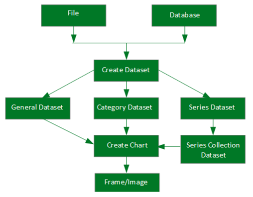
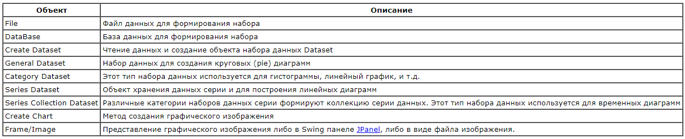

##Swing
В стандарт Java входит два пакета для создания оконного пользовательского интерфейса: awt и его надстройка swing. Компоненты swing имеют расширенные возможности по сравнению с аналогичными awt компонентами. Во-вторых, в отличие от awt компоненты swing не содержат платформо-зависимого кода и являются облегченными (lightweight) компонентами.

#### контейнеры верхнего уровня
JApplet — главное окно апплета;  
JFrame — окно приложения;  
JDialog — диалог приложения.  
JColorChooser — диалог выбора цвета;  
JFileChooser — диалог выбора файлов и директорий;  
FileDialog — диалог выбора файлов и директорий (awt компонент).  
####простые контейнеры
JPanel — простая панель для группировки элементов, включая вложенные панели;  
JToolBar — панель инструментов (обычно это кнопки);  
JScroolPane — панель прокрутки, позволяющая прокручивать содержимое дочернего элемента;  
JDesktopPane — контейнер для создания виртуального рабочего стола или приложений на основе MDI (multiple-document interface);  
JEditorPane, JTextPane — контейнеры для отображения сложного документа как HTML или RTF;  
JTabbedPane — контейнер для управления закладками;  
JSplitPane — контейнер, разделяющий два элемента и позволяющий пользователю изменять их размер.  
#### элементы интерфейса
JButton — кнопка;
JCheckBox — кнопка-флажок;
JComboBox — выпадающий список; и т.д.

## JFreeChart
Используя JFreeChart можно создавать все основные типы 2D и 3D графики : круговые диаграммы, гистограммы, линейные и временные диаграммы.

